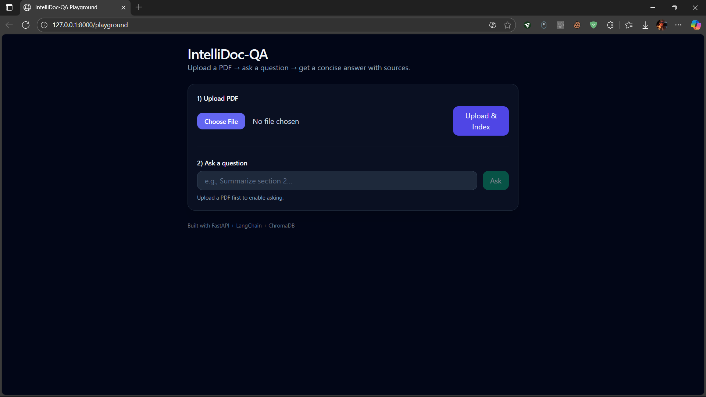
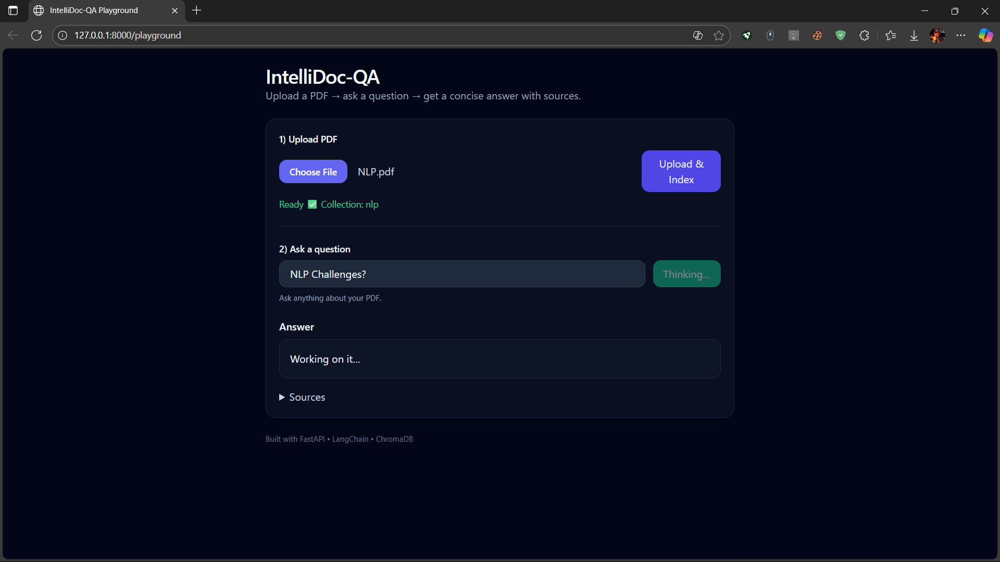
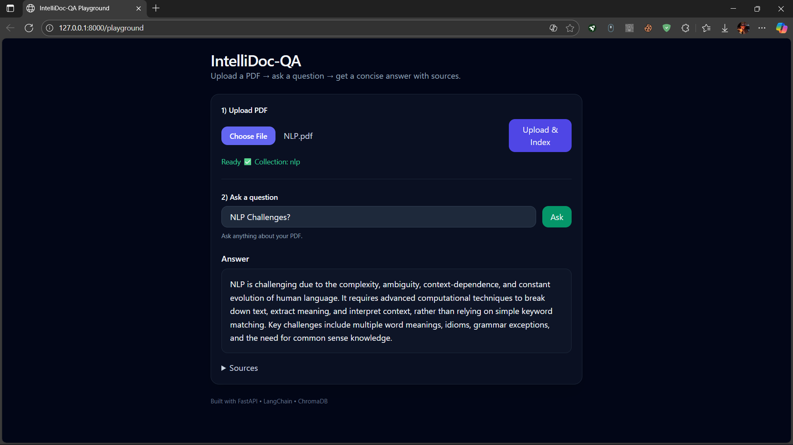
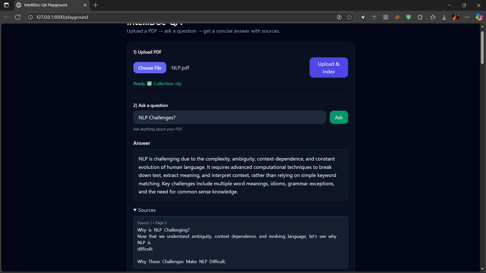

# 💡 IntelliDoc-QA  

IntelliDoc-QA is an AI-powered question-answering system for PDF documents.  
Upload a PDF, index it into Pinecone, and ask questions through either the **FastAPI endpoints** or the built-in **web UI** powered by Jinja2 templates.  

---

## 📸 Screenshot






---

## ✨ Features  
- 📄 Upload and process PDF files  
- 🔎 Split into chunks & generate embeddings (OpenAI + Pinecone)  
- 🤖 Ask natural-language questions about the document  
- 🌐 Web interface (`index.html`) for chat-like interaction  
- ⚡ Real-time streaming responses  

---

## 🛠️ Tech Stack  
- **Backend**: FastAPI, Uvicorn  
- **LLM / Embeddings**: OpenAI (Chat + Embeddings API)  
- **Vector Database**: Pinecone  
- **Document Parsing**: PyPDFLoader (LangChain Community)  
- **Frontend**: HTML + Jinja2 templates  
- **Other**: LangChain, dotenv, Pydantic  

---

🌐 API Endpoints
GET /

Serves the web interface (index.html).

POST /upload

Upload a PDF for processing.

Request: multipart/form-data with file (PDF)

Response: JSON with doc_id (unique hash namespace for embeddings)

POST /ask

Ask a question about an uploaded PDF.

Form Data:

doc_id – ID from the upload step

query – question in natural language

Response: streaming answer text

---

## 🚀 Getting Started  

### 1. Clone the repo  
```bash
git clone https://github.com/tech-savvy1/IntelliDoc-QA.git
cd IntelliDoc-QA

2. Create a virtual environment & install dependencies
python3 -m venv venv
On Windows: venv\Scripts\activate
pip install -r requirements.txt

3. Set up environment variables

Create a .env file in the project root with:

OPENAI_API_KEY=your_openai_api_key
PINECONE_API_KEY=your_pinecone_api_key
PINECONE_ENVIRONMENT=your_pinecone_environment
PINECONE_INDEX_NAME=intellidoc-qa

4. Run the app
uvicorn main:app --reload

Visit: http://localhost:8000
